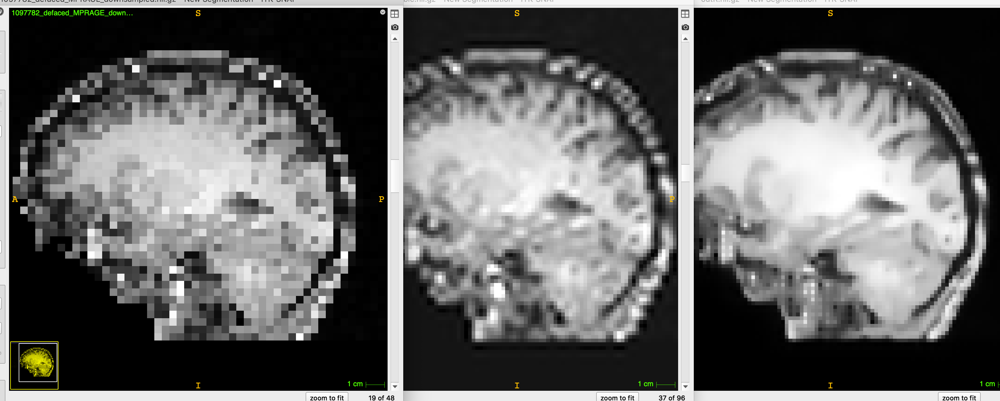

# App:  MRI super resolution

Deep learning app made for T1-weighted MRI brain extraction using ANTsRNet or ANTsPyNet

## Prerequisites

* [R](https://www.r-project.org) installation
* [ANTsR](https://github.com/ANTsX/ANTsR) installation
* [ANTsRNet](https://github.com/ANTsX/ANTsRNet) installation

or

* python 3
* [ANTsPy](https://github.com/ANTsX/ANTsPy) installation
* [ANTsPyNet](https://github.com/ANTsX/ANTsPyNet) installation

## Model training notes

## Sample prediction usage

```
#
#  Usage:
#    Rscript doSuperResolution.R inputImage outputImage
#
#  MacBook Pro 2016 (no GPU)
#

$ Rscript Scripts/doSuperResolution.R Data/Example/1097782_defaced_MPRAGE_downsampled.nii.gz 1097782_defaced_MPRAGE_superResolution.nii.gz

*** Successfully loaded .Rprofile ***

Loading required package: ANTsRCore

Attaching package: ‘ANTsRCore’

The following objects are masked from ‘package:stats’:

    sd, var

The following objects are masked from ‘package:base’:

    all, any, apply, max, min, prod, range, sum

Reading  Data/Example/1097782_defaced_MPRAGE_downsampled.nii.gz  (elapsed time: 0.008636951 seconds)
Using TensorFlow backend.
Loading weights file
Applying super resolution to image 1 of 1
   (elapsed time: 1.079538 seconds)
Writing output image.
  (Total elapsed time: 1.257627 seconds)
```

```
#
#  Usage:
#    python doSuperResolution.py input_image output_image
#
#  MacBook Pro 2016 (no GPU)
#

$ python Scripts/doSuperResolution.py Data/Example/1097782_defaced_MPRAGE_downsampled.nii.gz 1097782_defaced_MPRAGE_superResolution.nii.gz
Using TensorFlow backend.
Reading  Data/Example/1097782_defaced_MPRAGE_downsampled.nii.gz
  (elapsed time:  0.007602214813232422  seconds)
Loading weights file
  (elapsed time:  1.001905918121338  seconds)
Applying super resolution to image 0 of 1
   (elapsed time: 61.51974678039551 seconds)
Writing output image.
Total elapsed time:  64.18981695175171 seconds
```

## Sample results

original/bspline cubic interpolation/super-resolution


